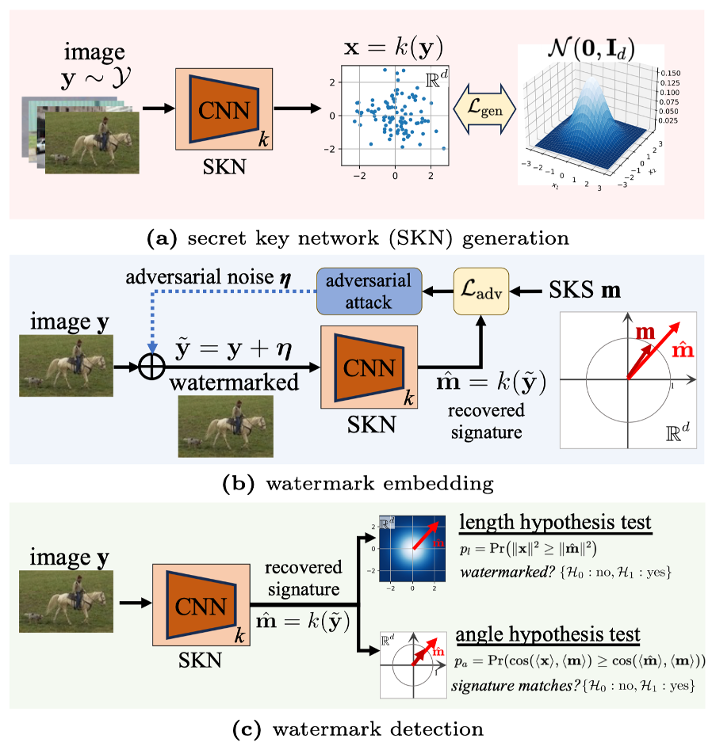

# ECCV2024-AA-WM
Code for ECCV2024 paper "A Secure Image Watermarking Framework with Statistical Guarantees via Adversarial Attacks on Secret Key Networks"

# A Secure Image Watermarking Framework with Statistical Guarantees via Adversarial Attacks on Secret Key Networks

## Abstract

> **A Secure Image Watermarking Framework with Statistical Guarantees via Adversarial Attacks on Secret Key Networks** 
Feiyu CHEN, Wei LIN, Ziquan LIU, Antoni B. CHAN 
> **Abstract**: Imperceptible watermarks are essential in safeguarding the content authenticity and the rights of creators in imagery. Recently, several leading approaches, notably zero-bit watermarking, have demonstrated impressive imperceptibility and robustness in image watermarking. However, these methods have security weaknesses, e.g., the risk of counterfeiting and the ease of erasing an existing watermark with another watermark, while also lacking a statistical guarantee regarding the detection performance. To address this issue, we propose a novel framework to train a secret key network (SKN), which serves as a non-duplicable safeguard for securing the embedded watermark. The SKN is trained so that natural images' output obeys a standard multi-variate normal distribution. To embed a watermark, we apply an adversarial attack (a modified PGD attack) on the image such that the SKN produces a secret key signature (SKS) with a longer length. We then derive two hypothesis tests to detect the presence of the watermark in an image via the SKN response magnitude and the SKS angle, which offer a statistical guarantee of the false positive rate. Our extensive empirical study demonstrates that our framework maintains robustness comparable to existing methods and excels in security and imperceptibility.

 

  

> Our secret-key watermarking framework. (a) the SKN is trained so that its output follows a standard multi-variate normal (SMVN) distribution given an input image distribution; (b) given an  image, the watermark is generated using adversarial attack that makes the SKN output the desired secret key signature (SKS) with extended length; (c) the signature is recovered by applying the SKN to the image, and the watermark is detected using hypothesis tests derived from the assumed SMVN distribution of the SKN.

We will realse our code later.

